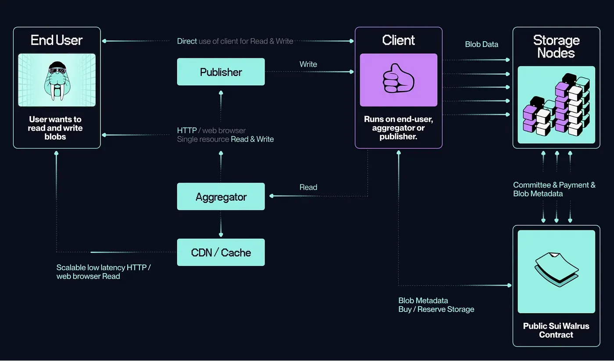

# **Walrus in a nutshell**

Bài viết này giải thích về **Walrus: A Decentralized Storage Solution** 


> Walrus is a decentralized storage solution that provides cheap, out-of-the-box features for large blobs, long periods of storage, and flexible storage nodes, making it suitable for applications where decentralization matters and single points of failure are undesirable

Giải thích dễ hiểu thì Walrus là giải pháp để mình lưu trữ phi tập trung với chi phí thấp cho các khối dữ liệu lớn, thời gian lưu trữ dài, và các nodes lưu trữ flexible, phù hợp cho các decentralization application.  Lưu trữ thì tất nhiên nó rất quan trọng rồi và dữ liệu thì phải luôn có tính data availability. 

Các ứng dụng đều luôn cần lưu trữ data, đó có thể là **data input, program hay result nào đó**. Vì thế mà walrus cũng có nhiều use cases khác nhau. 

Vậy thì tại sao ta phải nói tầm quan trọng của **Decentralization là data ownership và security.** 

> Walrus promotes decentralization to ensure users maintain ownership of their data, avoiding the pitfalls of centralized systems that can lead to censorship and data loss.

Walrus thúc đẩy **data ownership** bằng cách trao lại quyền kiểm soát dữ liệu cho chính user  không ai khác. Trong khi các mô hình centralized service như AWS hay Google Cloud thì ngược lại. Dữ liệu bạn upload là dữ liệu bị kiểm soát. Bạn là user, nhưng đôi khi lại thành sản phẩm.

> “If you’re not paying for the product, you are the product.”

Nhưng với Walrus thì khác. Vì nó phi tập trung nên: 
* 	Data luôn thuộc về bạn, không ai can thiệp được.
* Lưu trữ redundant, đảm bảo **data availability và integrity**.
* Ai cũng có thể tham gia hệ thống lưu trữ bằng cách fund thông qua **protocol-level incentives** ví dụ như stake token, hoặc cung cấp node.


**Decentralized storage isn’t just about hosting files — it’s about freedom, resilience, and long-term sustainability for your project.** 

Tweet của Adeniyi.sui khi nói về Walrus + Sui: https://x.com/EmanAbio/status/1848785669700915623


# **How Walrus Works: Breaking It Down**

Walrus không chỉ là nơi lưu trữ dữ liệu, mà còn là một lớp điều phối dữ liệu phi tập trung decentralized data coordination layer cho dev quyền set rule, gán permission, và thiết lập các quy trình tự động xung quanh dữ liệu đó.

* Walrus blobs: blob như những “hộp dữ liệu”có thể là file ảnh, video, model AI, code…. Mỗi blob có ID riêng biệt, có thể chia nhỏ thành các shard để lưu rải rác trên nhiều node, đảm bảo **redundancy (dự phòng) và resilience (bền vững)**.
* 🗄 Storage Nodes:. Mỗi node phải chứng minh độ tin cậy bằng cryptographic proof, và để stake WAL token 

* Aggregators: Aggregators không lưu trữ dữ liệu, nhưng đóng vai trò rất quan trọng trong việc tối ưu hoá việc truy xuất và quản lý metadata. Họ tạo ra chỉ mục (index) cho các blob, cho phép người dùng tìm kiếm và truy xuất dữ liệu nhanh hơn. Giúp điều phối việc phân phối dữ liệu từ nhiều storage node khi có truy vấn đến. Có thể được dùng để quản lý caching, load balancing và tối ưu UX của các ứng dụng dApp xây dựng trên Walrus.





# **Hosting a local Walrus Site portal**


https://www.youtube.com/watch?v=ktjvd8y7qY8

*This guide is for **Sui and Walrus mainnet**. Here is a video demo that follows this guide

# Introduction

Create your own decentralized website by utilizing the power of the Sui blockchain, resilience of Walrus, and the seamless UX of SuiNS.

**In this tutorial you:**

1. [Build a website](https://www.notion.so/10337af41c6e80109cb1ee7912de19c2?pvs=21)
2. [Upload it to Walrus](https://www.notion.so/10337af41c6e80109cb1ee7912de19c2?pvs=21)
3. [Point your SuiNS name to it](https://www.notion.so/10337af41c6e80109cb1ee7912de19c2?pvs=21)

# Build a website

In this section, create a basic Sui website to deploy to Walrus using the [Sui Dapp starter kit](https://sdk.mystenlabs.com/dapp-kit/create-dapp). 

## Install the template

1. Run `pnpm create @mysten/dapp` in your terminal.
2. Select `react-client-dapp`
3. Name your project

## Build the site

1. Run `pnpm install` to install dependencies
2. Run `pnpm build` to build the site for deployment

# Upload it to Walrus

After you have a build of your app, deploy it to Walrus using the Walrus site builder CLI tool.

## Install Dependencies

1. [Install Walrus CLI](https://docs.wal.app/usage/setup.html)
2. [Install site-builder](https://docs.wal.app/walrus-sites/tutorial-install.html)

## Deploy to Walrus

Run the following command to deploy your site to Walrus: 

```rust
site-builder --config {PATH_TO_CONFIG} publish {PATH_TO_APP}/dist --site-name "decentralized website test" --epochs 200 
```

After a successful deployment, you should receive a similar output:

```markdown
Storing resources on Walrus: batch 1 of 1 ... [Ok]
Applying the Walrus Site object updates on Sui ... [Ok]

Execution completed
Resource operations performed:
  - created resource /assets/index-C8a3C9Y3.js with blob ID W6lLyahP4IgJh7t36vOO22m23ZTATzMyyRwrk733bgg
  - created resource /assets/index-scVC05-f.css with blob ID I22agaqaim_M3oRHwXjF4nbtAVba4SZDDQMXFAZns-Y
  - created resource /index.html with blob ID jQ6aA4VEElNJnC7PL7G2he48TeICY6e2jKD2QQHuyrQ
The site routes were left unchanged

Created new site: test-website
New site object ID: 0xf98a54de897b50ed014d7c99d7ae5471ec3b5fd0f517d36f6ae5bc2e1083ce37
To browse the site, you have the following options:
        1. Run a local portal, and browse the site through it: e.g. http://67wi4siou7p4kljjwmejdd98ofl7vnte8bhwu1flfua8r7mmgn.localhost:3000
           (more info: https://docs.wal.app/walrus-sites/portal.html#running-the-portal-locally)
        2. Use a third-party portal (e.g. wal.app), which will require a SuiNS name.
           First, buy a SuiNS name at suins.io (e.g. example-domain), then point it to the site object ID.
           Finally, browse it with: https://example-domain.wal.app
```

This contains the ID of your Walrus site’s Sui object (`0xf98a54de897b50ed014d7c99d7ae5471ec3b5fd0f517d36f6ae5bc2e1083ce37`). 

# Point your SuiNS name to it

Now that you have your deployed Walrus site, point a SuiNS name to it to be accessible by the [wal.app](http://wal.app) portal. 

## Buy a SuiNS name

Navigate to [SuiNS](https://suins.io/) and buy a name.


## Link your SuiNs name

Set your SuiNS name to the address of your Walrus site’s Sui object (provided in the Walrus site deployment output above)


## Navigate to your site with your SuiNS name

You can now navigate to `https://{SuiNS name}.wal.app` to view your finished decentralized site!

https://x.com/_smbrian/status/1909468495676686837

# Reference

1. https://medium.com/@thaninsta/what-is-walrus-a-detailed-guide-163f3c236171

[
**Building Your First Walrus Site on Sui Testnet (on Windows 11)**
](https://www.notion.so/Building-Your-First-Walrus-Site-on-Sui-Testnet-on-Windows-11-1e44f8e09bb380f08d36c7cf3880b49d?pvs=21)

[Walrus ecosystem Map ](https://www.notion.so/Walrus-ecosystem-Map-1e54f8e09bb38092913dd32f2967b255?pvs=21)


# 
0. https://x.com/EmanAbio/status/1848785669700915623 
1. https://www.youtube.com/watch?v=0T9X1gGoUtk
2. https://www.youtube.com/watch?v=4_b8vfcSSa4
