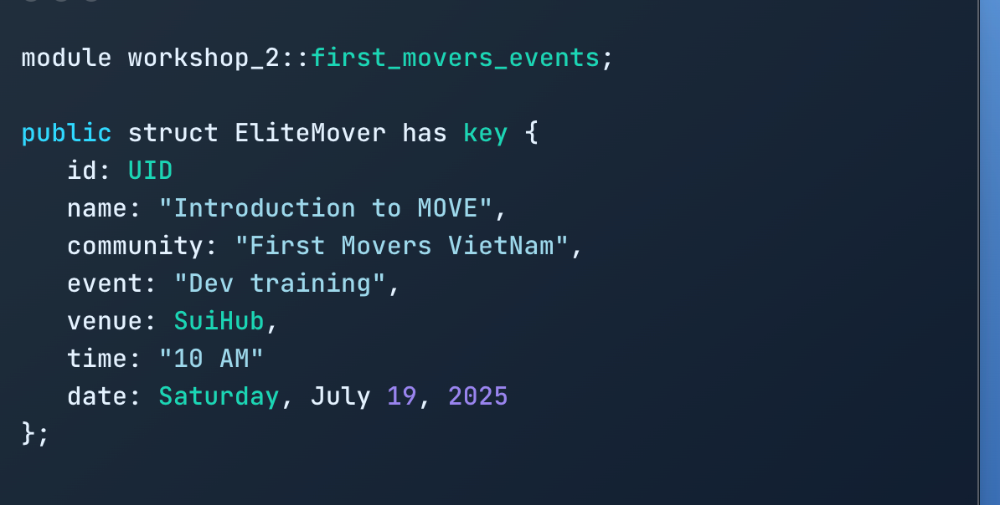

---
title: A Deep Dive into the Ethereum Virtual Machine (EVM) - Part 3  Execution Model of the EVM 
summary: This is a high-level overview of the execution model of the Ethereum Virtual Machine (EVM). It outlines the state(s) of the machine that changes between the exe
authors:
  - Harry Phan 
date: 2025-07-19
some_url: 
---

# Workshop move 101 buổi 2 

Buổi workshop này mình chia sẻ với mọi người về objects, resources trên Sui. 
