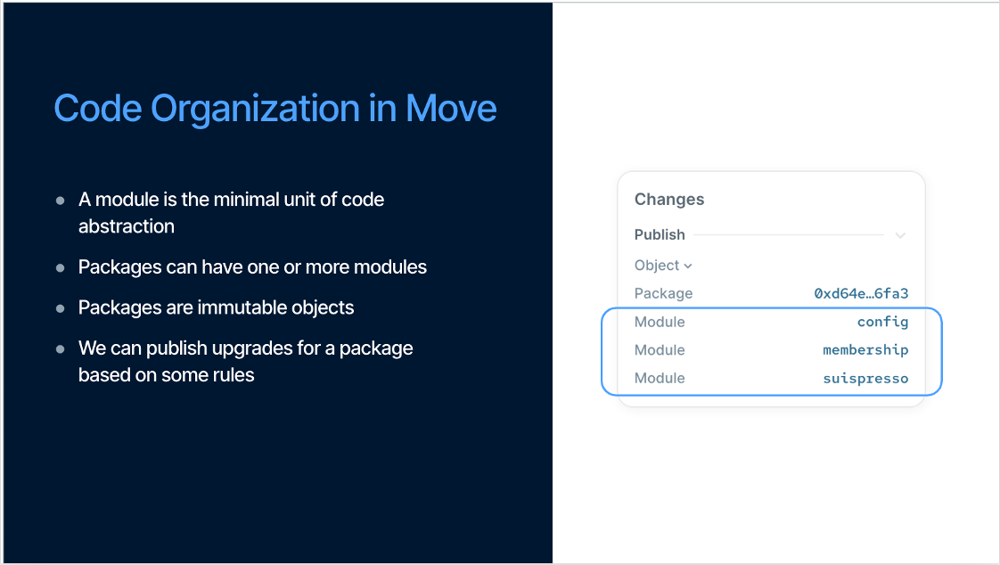

# Advanced Smart Contract – Modules, Entry Functions & Practice


link event: 

#  Nội dung chính:

* ​Hiểu rõ vai trò và cấu trúc của Module trong Move

​* Tìm hiểu Entry Function – cách tương tác với contract thông qua call

​* Tổ chức project chuẩn theo cấu trúc Move.toml và sources/

​* Viết thêm các chức năng nâng cao cho token và NFT đã học


# 1. Review lại nội dung học tuần trước 

Slides xem lại buổi 2 nghe: https://x.tusky.io/Zoo9i 

# 2. Vậy package là gì ?

Theo định nghĩa từ documentation:

> Packages are immutable. After you publish a package object on chain to a network, it lives there forever. You cannot directly change the code of an on-chain

Nghĩa là một package là khi được publish trên Blockchain và được xác định là một address. Trong package có thể chứa một hoặc nhiều modules.



Riêng phần Package, mình sẽ chia nhỏ thành từng phần là: 

* Package Layout: Cấu trúc của package
* Published Package: Các package đã được published bạn cần lưu ý
* Manifest Structure( Move.toml ): Config file trong sui move contract
* Artifact


## 2.1 Package Layout

Một package sẽ chứa nhiều Modules. Trong từng modules đó bao gồm functions, types...

Đây là ví dụ minh hoạ cho một package layout:

```
package HELLO_WORLD
    module a
        struct A1
        fun hello_world()
    module b
        struct B1
        fun hello_package()
```

Để tạo package mới, bạn có thể sử dụng lệnh CLI Sui move new <Name Package>. Mục đích của Move package system là để cho phép các developer có thể define dễ dàng nơi chứa các move code, bạn có thể import và use packages ở file move code khác.


## 2.2 Manifest Structure( Move.toml ): Config file trong sui move contract

Một thư mục source move package sẽ luôn có `Move.toml` là package manifest file bao gồm các metadata cho package đó. File này vô cùng quan trọng vì nó quản lý các dependencies, đảm bảo được môi trường stable cho move project của bạn và để quản lý project. Đây là cấu trúc của một package layout:


Root của project là tên folder move project của bạn. Trong folder sẽ chứa các files để chạy move project. Trên hình bạn đã thấy các components quan trọng **Move.toml, Move.lock và thư mục sources.**

Đối với **Move.toml** và **Move.lock** chịu trách nghiệm trong việc quản lý các dependencies. Còn trong thư mục **Source** là nơi ta thấy các file module.move. Các file này chính là core logic của move code. Ngoài ra, còn có thư mục test. Đây là nơi để bạn có thể viết test case cho move code của bạn đảm bảo dự án chạy như kì vọng và maintain được chất lượng codebase.


Cấu trúc được thiết kế giúp cho các developer có thể quản lý code dễ hơn. Tuy nhiên đây chưa honaf toàn là cấu trúc đầy đủ. Nó còn thêm doc_templates và examples.

```rust
Your_Move_Project
├── Move.toml      (required)
├── Move.lock      (generated)
├── sources        (required)
├── doc_templates  (optional)
├── examples       (optional, test & dev mode)
└── tests          (optional, test mode)
```


* Move.toml file:  Đây là package manifest (mình không biết dịch tiếng việt sao nên hiểu như package.json nhé) chứa các metadata cần thiết cho package. Các thông tin trong package đó bao gồm


---
# 3. Modules trong Sui là gì ?

Ở Sui Move, khi khai báo một smart contract, ta sẽ sử dụng từ khoá module, giống với ở solidity ta sẽ có từ contract. Đây là syntax khi khai báo smart contract

```
module <package_name>::<module_name> { 
    //module code ở đây 
}
```

Nhưng mọi người có thể set up một module thế này cũng được:

```
module <package_name>::<module_name>;
```

`package_name` là tên của package mà bạn đã tạo. Ví dụ trong lệnh `sui move new hello_world` thì package name sẽ là `hello_world`. Còn `module_name` sẽ là cái tên module mà bạn đã tạo trong package.


Ở đây bạn cũng có thể xem như `module` là thư viện con trong package.

> Tính chất đóng gói (encapsulation) của module giúp cho việc phát triển smart contract trở nên module hóa, có khả năng kết hợp linh hoạt, đồng thời nâng cao khả năng tái sử dụng mã nguồn và tính bảo mật.


## 3.1 Từ khoá use - cách để import bất kỳ module

Trong Sui move, `use` được sử dụng để import bất kì module. Đây là cấu trúc của cách sử dụng use:

```
use <Address/Alias>::<ModuleName>;
```

Giải thích về `<Address/Alias>` và `<ModuleName>`:

* `<Address/Alias>` là những địa chỉ của package có chứa những module mà ta muốn dùng. Chúng ta thể sử dụng alias được đặt trong Move.toml mà đã viết ở mục Package manifest. Ví dụ: 

```
[addresses]
sui = "0x2"
# Trước là suilend = "0x0" nhưng giờ package đã published rồi nên ta có thể thay thế thành
suilend = "0xf95b06141ed4a174f239417323bde3f209b972f5930d8521ea38a52aff3a6ddf"
```


* `<ModuleName>` đơn giản đại diện cho tên của module đó.

Sau đây là một số Sui modules mà bạn sẽ thường sử dụng:

```rust
# Module này giúp chúng ta xử lý liên quan đến string 
use std::string;
 
// https://github.com/MystenLabs/sui/blob/main/crates/sui-framework/packages/move-stdlib/sources/string.move
 
# Module này sẽ giúp khi ta cần các chức năng transfer object từ một account đến account khác 
use sui::transfer; 
// https://github.com/MystenLabs/sui/blob/main/crates/sui-framework/packages/sui-framework/sources/transfer.move
 
# dòng dưới đây giúp cho việc tạo object trong module.
use sui::object;
// https://github.com/MystenLabs/sui/blob/main/crates/sui-framework/packages/sui-framework/sources/object.move
 
 
# Đây là đoạn import từ sui framework. Giúp ta trong việc đinh nghĩa các thông tin của transaction như là địa chỉ của sender, địa chỉ người ký ...
use sui::tx_context;
// https://github.com/MystenLabs/sui/blob/main/crates/sui-framework/packages/sui-framework/sources/tx_context.move
```

Bên cạnh việc import một module, Move cho phép bạn import cụ thể đối tượng từ module bao gồm functions và types. Điều này hữu ích khi bạn chỉ muốn một chức năng của module, Giảm việc không cần những đoạn code không cần thiết. Ví dụ:

```
// import function từ một module 
use sui_bootcamp::module_one::learn; 
 
// import từ Learner Type 
use sui_bootcamp::module_one::Learner;
```

Không chỉ thế Move cho phép ta import nhiều từ module hoặc package bằng cách dùng dấu `{}`:

```
// import learn function và Learner type từ module one
use sui_bootcamp::module_one::{learn, Learner};
 
// import module và Learner type
 
use sui_bootcamp::module_one::{Self, Learner};
```


> Làm sao để giải quyết vấn đề trùng tên? (Name conflict) 👀 
> Mình để các bạn tìm câu trả lời nhé hoặc thảo luận trong nhóm First Movers 
----

# 4. ​Tìm hiểu Entry Function – cách tương tác với contract thông qua call

Trước tiên bạn cần hiểu về **Visibility (phạm vi truy cập) trong module**.

Mỗi phần tử (member) trong một module đều có visibility tức là mức độ cho phép truy cập từ bên ngoài hay không? Theo mặc định trong Sui move, tất cả các member đều là private nghĩa là anh em chỉ được dùng trong chính module nơi chúng được định nghĩa

Đây là ví dụ cho entry function:

```
entry fun mint(ctx: &mut TxContext) {
 
    let object = HelloWorldObject {
        id: object::new(ctx),
        text: string::utf8(b"Hello World!")
    };
 
    transfer::public_transfer(object, tx_context::sender(ctx));
}

```

`&mut TxContext`chính là biến tham chiếu có thể thay đổi được giúp cho việc biết địa chỉ sender là ai để mint được contract này. Trong đó hàm transfer ở cuối function không phải trả về bất kì giá trị gì mà giúp store object vào địa chỉ sender sau khi publish module.


## 4.1 Sự khác biệt giữa public và entry trong Sui Move

Trong Sui Move, hai từ khóa `public` và `entry` đều dùng để định nghĩa hàm có thể được gọi từ bên ngoài module. Nhưng cách mà chúng được gọi, và ai được quyền gọi lại khác nhau khá rõ.

Khi bạn dùng `public fun`, hàm đó có thể được gọi từ bất kỳ đâu: trong cùng module, từ module khác trong cùng package, thậm chí từ module khác hoàn toàn nếu bạn import nó.

Đây là kiểu viết phổ biến nhất khi bạn muốn chia sẻ logic giữa nhiều module. Nhưng nó cũng giống như bạn mở cửa nhà và mời mọi người vô :V.


Còn Còn `entry`  fun thì là một kiểu đặc biệt. Hàm có entry chỉ được gọi trực tiếp từ transaction — tức là từ một Programmable Transaction Block (PTB). Frontend có thể gọi, ví có thể gọi.


Tất nhiên một entry function vãn có thể gọi bởi các  Move functions khác trong cùng module
```
module a::m {
    entry fun foo(): u64 { 0 }
    fun calls_foo(): u64 { foo() } // valid!
}

module a::n {
    fun calls_m_foo(): u64 {
        a::m::foo() // ERROR!
//      ^^^^^^^^^^^ 'foo' is internal to 'a::m'
    }
}
```

Nhưng trong module khác thì không được phép wrap hoặc gọi lại hàm đó.  Điều này cực kỳ quan trọng khi bạn viết những logic nhạy cảm như randomness, mint NFT, hoặc bất kỳ thứ gì có thể bị lợi dụng nếu người khác wrap lại hàm của bạn và thử chạy trước. 


Một chi tiết nữa là `entry` thường đi chung với `&mut TxContext` 

Nhưng entry không phải không có giới hạn. Vì để đảm bảo an toàn cho hệ thống sẽ có một số quy tắc sau. 

## 4.2  Rule ràng buộc riêng của Sui đối với entry

* Chỉ được return các kiểu có drop ability (để Sui đảm bảo không leak object ownership)

* Ngoài ra, nếu bạn dùng một object nào đó trong entry fun, bạn không được phép sử dụng lại object đó trong một non-entry khác trong cùng PTB. Điều này giúp Sui tránh được việc cùng một object bị xử lý trong hai context khác nhau.


### 4.3 No public entry, Only public or entry 

Nếu bạn viết code như thế này: 

```
// ❌ Sai: dùng `entry` không cần thiết, vì không bắt buộc để gọi hàm từ transaction
public entry fun do_something() { /* ... */ }

// ✅ Đúng: dùng `public` thôi là đủ — vừa gọn, lại cho phép return giá trị public 
fun do_something_2(): T { /* ... */ }

```