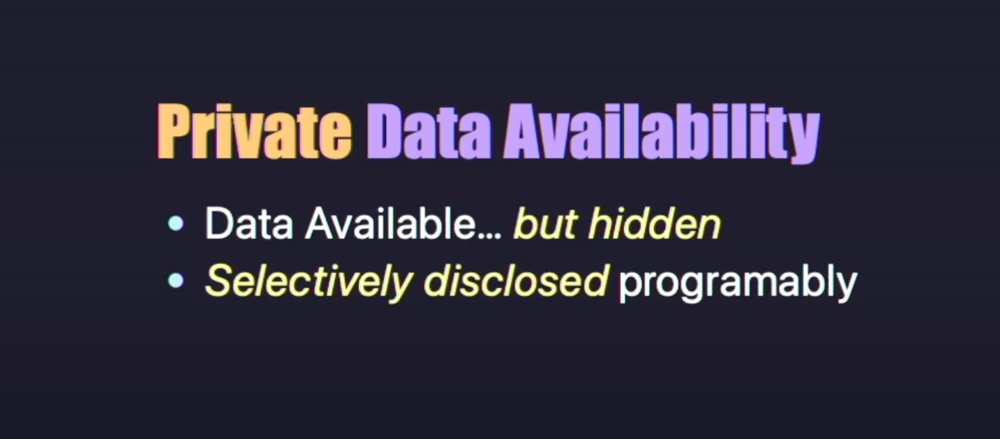
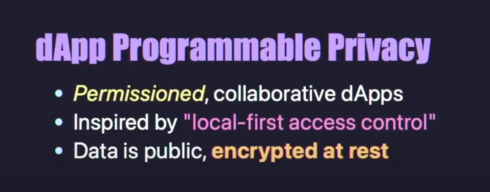

# VERIFIABLE ENCRYPTION & PRIVATE Data trên Celesti

> “Privacy matters. But so does verifiability.” — Celestia Labs

# Các khái niệm cốt lõi mà bạn cần nắm (Core Concepts)

Dưới đây là danh sách các khái niệm kỹ thuật quan trọng liên quan đến Private Data Availability trên Celestia. Bạn nên tra cứu sâu hơn từng thuật ngữ để hiểu rõ cơ chế và ứng dụng của nó.

* **Private Data Availability (PDA)**: Cơ chế cho phép bạn publish encrypted data lên Celestia DA layer và vẫn prove data availability (chứng minh dữ liệu tồn tại và có thể truy xuất) mà không cần công khai nội dung.

* **Verifiable Encryption (VE)**: Kỹ thuật prove claims/properties about encrypted data (chứng minh tính đúng/sai liên quan đến dữ liệu mã hoá) without decrypting it.

* **zkVM (Zero-Knowledge Virtual Machine)**: Một  máy ảo có thể prove that a program ran correctly (chứng minh chương trình chạy đúng) mà không lộ input/output.

* **PDA Proxy**: Middleware đứng giữa app và Celestia, giúp auto-handle encryption/decryption  (tự động mã hoá/giải mã dữ liệu) trước khi gửi lên DA layer.

* **ChaCha20**: High-performance stream cipher (thuật toán mã hoá dòng) mạnh và nhẹ, phù hợp cho môi trường zkVM.

*  **Data Fingerprinting (Hash Commitments)**: Sử dụng cryptographic hash để tạo ra commitment cho một đoạn dữ liệu.

> Bạn có thể tra cứu các cụm từ khóa trên trong tài liệu Celestia Docs, GitHub repo, hoặc ZKPrimer để hiểu rõ hơn. Đây là foundational building blocks cho mọi ứng dụng cần privacy + verifiability.

# Private Data Availability (PDA) là gì?

Blockchains truyền thống vốn minh bạch theo mặc định — mọi giao dịch, mọi trạng thái đều hiển thị công khai. Điều này rất tốt cho tính phi tập trung và auditability, nhưng lại là rào cản lớn cho những ứng dụng cần sự riêng tư như **DEX riêng tư**, **Data marketplaces**, **Encrypted messaging**....

Như vậy Private Data Availability (PDA) cho phép devs đăng dữ liệu **đã mã hoá lên Celestia**, nhưng vẫn có thể chứng minh rằng dữ liệu đó **thật sự tồn tại và ai cũng có thể truy xuất được** (mặc dù chưa thể đọc nội dung).

[Nói tóm lại thì muốn tạo ra một nơi credibly neutral trung lập theo cách mà ai cũng tin được để phục vụ cho việc Data Availability (DA) một cách công khai, minh bạch, nhưng đồng thời vẫn có khả năng chọn lọc ai được đọc nội dung bên trong.](https://docs.google.com/document/d/1XZyuOxdMm5INcHwQZOZ8ALRk_YkvicNwQHSfOVs8hoM/edit?tab=t.0#heading=h.dtwabt1t9yhe)

Vì bất kỳ ai cũng có thể truy cập được dữ liệu, nên ta cần một cách để định nghĩa điều kiện nào cho phép đọc được nội dung đó (gọi là selective disclosure tiết lộ chọn lọc).

Với một mạng DA phi tập trung như Celestia, bất kỳ giao thức nào cần truy cập dữ liệu đều có đảm bảo chắc chắn rằng khi dữ liệu đã được publish thì không bên nào có thể che giấu hoặc giữ lại nó (retrievability guarantee) – ít nhất là trong một khoảng thời gian nhất định.

Thêm nữa, nhờ vào cơ chế Data Availability Sampling (DAS), bất kỳ ai cũng có thể xác minh một cách ngắn gọn rằng dữ liệu đã thực sự được công bố mà không cần phải download toàn bộ dữ liệu gốc.

# Cốt lõi của PDA: Verifiable Encryption (VE)

Khi kết hợp với Verifiable Encryption (VE) tức là kỹ thuật mã hoá cho phép chứng minh những điều đúng/sai liên quan tới dữ liệu mã hoá mà không cần giải mã. Chúng ta sẽ vẫn giữa được bí mật mà vẫn chứng minh tính hợp lệ.

Thay vì chỉ mã hoá đơn thuần, VE cho phép bạn “cam kết” rằng ciphertext đang chứa một nội dung thỏa mãn điều kiện nào đó — ví dụ như khớp với một hash cụ thể, hoặc chứa một giá trị nằm trong tập giá trị được chấp nhận — và tất cả điều đó được chứng minh qua một bằng chứng không tiết lộ gì về nội dung thực tế bên trong.

> Bằng chứng này được sinh bởi zkVM và ai cũng có thể verify mà không cần giải mã dữ liệu

# Kiến trúc PDA Proxy 

Để triển khai nhanh chóng PDA, Celestia Labs xây dựng một **proxy middleware** cho các ứng dụng:

* Là cầu nối giữa app của bạn và Celestia node
* Tự động mã hoá dữ liệu + sinh bằng chứng zk khi upload
* Tự động giải mã khi truy xuất (nếu có khoá)
* Sử dụng **zkVM prover network (hiện tại là Succinct)** để xử lý các bằng chứng VE

> Dev chỉ cần gọi proxy thay vì node Celestia trực tiếp vì tất cả quy trình mã hoá, sinh chứng cứ, upload được xử lý ở backend

| Tiêu chí                                | Encryption thông thường                        | Verifiable Encryption (VE)                               |
|----------------------------------------|------------------------------------------------|----------------------------------------------------------|
| Mục đích chính                         | Bảo vệ nội dung khỏi người ngoài               | Bảo vệ nội dung **và** chứng minh thuộc tính dữ liệu     |
| Ai có thể xác minh                     | Chỉ người có khóa                              | Bất kỳ ai (dựa trên bằng chứng zk)                       |
| Chứng minh nội dung đúng               | ❌ Không thể                                   | ✅ Có thể chứng minh thuộc tính cụ thể của dữ liệu       |
| Lộ thông tin dữ liệu gốc               | Không (nếu bảo mật tốt)                         | Không (bằng zero-knowledge proof)                        |
| Phù hợp với use case nào               | Lưu trữ riêng tư, không cần chứng minh         | DEX, data marketplace, zk-identity, whistleblowing...    |
| Yêu cầu tính toán zk proof             | ❌ Không                                       | ✅ Có, cần zkVM hoặc prover system                        |
| Triển khai trên blockchain             | Dữ liệu được mã hoá và đăng onchain            | Ciphertext + zk proof được đăng onchain                  |

# Các use cases 

* Ví dụ đầu tiên là Data Marketplace

Một người bán muốn bán một bức ảnh có độ phân giải cao. Trước khi người mua thanh toán, họ cần biết chắc chắn rằng file được mã hoá là đúng ảnh đó, nhưng không muốn tiết lộ ảnh.

Vậy thì chúng ta có `VE` sẽ giúp cam kết rằng ciphertext chứa đúng file với hash H(x) mà không giải mã.

* Hoặc ví dụ như Decentralized Uber

Người dùng cần gọi xe mà không tiết lộ vị trí công khai. PDA proxy sẽ mã hoá thông tin vị trí + đính kèm fingerprint thanh toán vù tài xế có thể xác minh & nhận lệnh ride nếu đồng ý.

* ví dụ khác nữa là Perps DEX & Emergency Recovery: Celestia Labs cũng đang làm việc cùng một DEX có nhu cầu đặc biệt: lưu thông tin người dùng một cách riêng tư, nhưng phải có khả năng khôi phục trong tình huống khẩn cấp. Toàn bộ thông tin người dùng được mã hoá và lưu lên Celestia thông qua PDA Proxy. Trong trường hợp bình thường, không ai có thể đọc được dữ liệu. Nhưng nếu xảy ra sự cố hệ thống, khóa giải mã sẽ được công khai thông qua một cơ chế emergency fallback (có thể là MPC, threshold key release hoặc multisig recovery), giúp người dùng tự rút tiền khỏi giao thức mà không phụ thuộc vào team dự án.

Đến đây bạn sẽ đặt câu hỏi **PDA Proxy có thể dùng cho những ai?**

Bất kỳ ai đang xây dựng ứng dụng có tính chất nhạy cảm về dữ liệu đều có thể tích hợp PDA Proxy từ DEX, encrypted off-chain storage, messaging app, đến data DAO hay decentralized Uber. Một số use case rất phù hợp như:

* Tin nhắn được đảm bảo đã gửi, nhưng không ai đọc được ngoài người nhận
* Trao đổi dữ liệu giữa Web2 với Web3 qua Celestia làm “invisible pipe”
* Gửi location tạm thời trong decentralized ride-sharing mà vẫn giữ bí mật

# Example dApps

* Private rollups/apps with (partial) obfuscation. Wrap your fav kit: Rollkit, OP, Nitro, …

* Verifiable Backups recover from "disaster": 

# Reference 
1. Github: https://github.com/celestiaorg/pda-proxy
2. Private Data Availability on Celestia docs: 
3. Slide Verifiable Encryption event: https://hackmd.io/@Nuke/SyHBUsdWlg#/
4. 